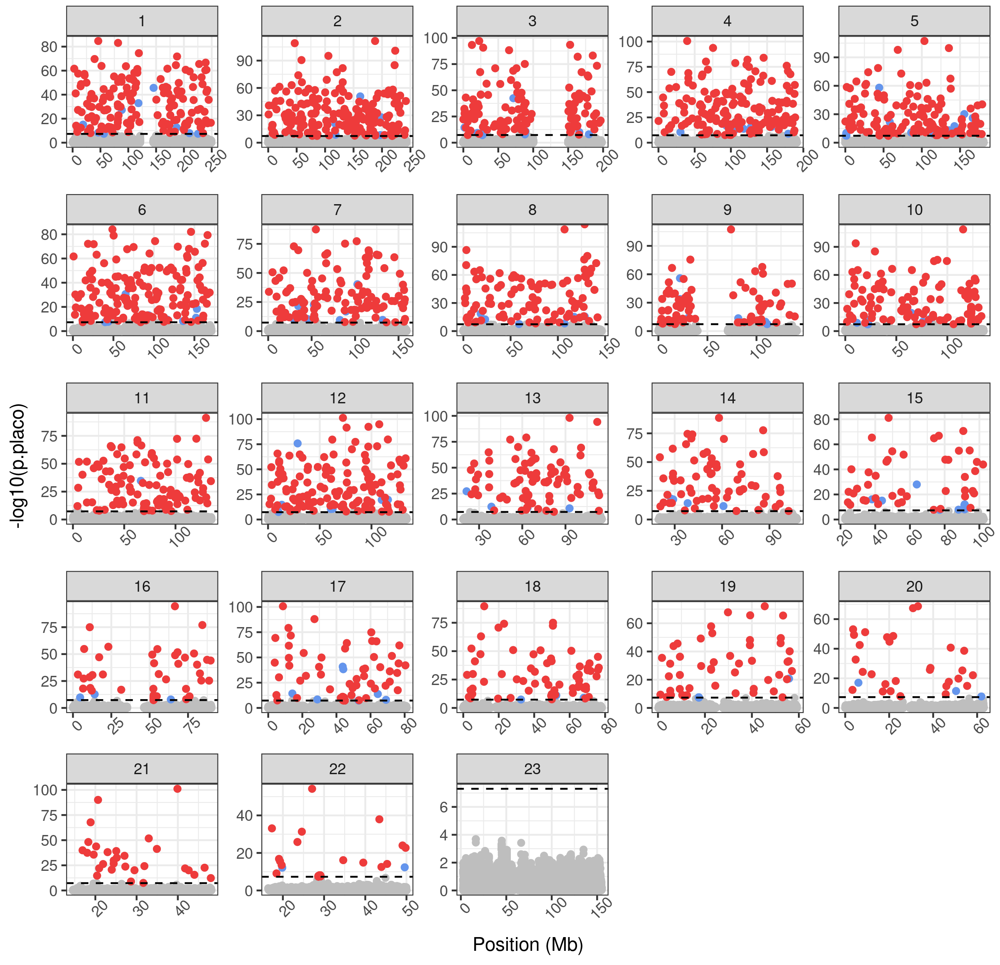

# PLACO
Created by: Yazdan Asgari<br>
Creation date: 24 Dec 2021<br>
Update: Feb 2024<br>
https://cesp.inserm.fr/en/equipe/exposome-and-heredity
<br>
<br>
**Ref:** Ray et al., "A powerful method for pleiotropic analysis under composite null hypothesis identifies novel shared loci between Type 2 Diabetes and Prostate Cancer",
PLoS Genet. 2020 Dec 8;16(12):e1009218, doi: 10.1371/journal.pgen.1009218 [Paper_link](https://pubmed.ncbi.nlm.nih.gov/33290408/)
<br>
<br>

Here is an example of running PLACO for two traits
<br>
**NOTE 1:** For running PLACO, first it is needed to extract common SNPs between two traits.
<br>
**NOTE 2:** PLACO needs **Z** column for running. So, if that column is not available in the GWAS data, a user should calculate it.
<br>
So, there are two parts: 1) finding common SNPs and calculation of the Z column, 2) running the PLACO function
## First Step
DEFINITION SECTION which should be changed by a user
```r
# directory in which input data exist
path_input_data_trait1 = "~/PLACO/"
path_input_data_trait2 = "~/PLACO/"

# the file names of input data
traits_1 <- "TRAIT_1.txt"
traits_2 <- "TRAIT_2.txt"

# directory in which an output data would be written
path_output_data = "~/PLACO/"

# The file names of the output data 
output_names <- c(  "TRAIT_1_Common_inc_Z",
                    "TRAIT_2_Common_inc_Z")

# used for filtering GWAS data              
info_threshold <- 0.8
MAF_threshold <- 0.01
```

libraries used in the code
```r
library(vroom)
library(dplyr)
library(data.table)
```

RUNNING SECTIONS
<br>
Summary: Reading GWAS data, filtering some SNPs, calculation of Z based on "beta" and "se", extraction of common SNPs between pair of GWAS data
```r
writeLines("\n\n")
print(traits_1)
writeLines("\n\n")
print(traits_2)
writeLines("\n\n")

# reading treat_1
gwas_traits_1 <- vroom(file=paste0(path_input_data_trait1, traits_1))
gwas_traits_1 <- as.data.frame(gwas_traits_1)

# reading treat_2
gwas_traits_2 <- vroom(file=paste0(path_input_data_trait2, traits_2))
gwas_traits_2 <- as.data.frame(gwas_traits_2)
```

**IMPORTANT NOTE**: The following columns MUST be available in the GWAS data. If not, a user could rename the columns in the GWAS data or make changes in the script.  
- snp (RS ID)
- chr (chromosome)
- bp_hg19 (base pair position)
- Effect_A (Effect Allele)
- nonEffect_A (non-Effect Allele)
- beta (beta value)
- se (standard error)
- pval (P-value)
- info (r2)
- EAF (Effect Allele Frequency)
- MAF (Minor Allele Frequency)

Now a user could continue to run the following codes:
```r
# filtering step
gwas_traits_1 <- select(filter(gwas_traits_1, gwas_traits_1$info > info_threshold & gwas_traits_1$MAF > MAF_threshold),
                        c("snp","chr","bp_hg19","Effect_A","nonEffect_A","beta","se","pval","info","EAF","MAF"))

gwas_traits_2 <- select(filter(gwas_traits_2, gwas_traits_2$info > info_threshold & gwas_traits_2$MAF > MAF_threshold),
                        c("snp","chr","bp_hg19","Effect_A","nonEffect_A","beta","se","pval","info","EAF","MAF"))
                        
# calculation of Z
# if se==0, put a VERY LARGE VALUE for Z (here 1.0e+08)
gwas_traits_1 %>% mutate(Z = case_when(gwas_traits_1$se == 0   ~ 1.0e+08 , gwas_traits_1$se != 0 ~ (gwas_traits_1$beta/gwas_traits_1$se) )) -> gwas_traits_1

gwas_traits_2 %>% mutate(Z = case_when(gwas_traits_2$se == 0   ~ 1.0e+08 , gwas_traits_2$se != 0 ~ (gwas_traits_2$beta/gwas_traits_2$se) )) -> gwas_traits_2

# merging two GWAS data based on "snp", "chr", and "bp_hg19" columns
gwas_merge <- inner_join(gwas_traits_1,gwas_traits_2, by = c("snp", "chr", "bp_hg19"))

# checking the number of total, unique, and duplicated rsids
length(gwas_merge$snp)
length(unique(gwas_merge$snp))
dim(gwas_merge[duplicated(gwas_merge$snp), ])[1]

# removing potential duplicated entries
gwas_merge <- gwas_merge[!duplicated(gwas_merge$snp), ]

# checking data after removing the duplicated entries
length(gwas_merge$snp)
length(unique(gwas_merge$snp))
dim(gwas_merge[duplicated(gwas_merge$snp), ])[1]

# extracting common SNPs for the first trait
gwas_traits_1 <- gwas_merge[, c("snp", "chr", "bp_hg19", 
                                "Effect_A.x", "nonEffect_A.x", "beta.x", "se.x", 
                                "pval.x", "info.x", "EAF.x", "MAF.x", "Z.x") ]
# rename the column names
colnames(gwas_traits_1) <- c("snp", "chr", "bp_hg19", 
                             "Effect_A", "nonEffect_A", "beta", "se", 
                             "pval", "info", "EAF", "MAF", "Z") 

# sorting based on the ID column
gwas_traits_1 <- as.data.table(gwas_traits_1)
gwas_traits_1 <- setorder(gwas_traits_1, snp)

# extracting common SNPs for the second  trait
gwas_traits_2 <- gwas_merge[, c("snp", "chr", "bp_hg19", 
                                "Effect_A.y", "nonEffect_A.y", "beta.y", "se.y", 
                                "pval.y", "info.y", "EAF.y", "MAF.y", "Z.y") ]
# rename the column names
colnames(gwas_traits_2) <- c("snp", "chr", "bp_hg19", 
                             "Effect_A", "nonEffect_A", "beta", "se", 
                             "pval", "info", "EAF", "MAF", "Z") 

# sorting based on the ID column
gwas_traits_2 <- as.data.table(gwas_traits_2)
gwas_traits_2 <- setorder(gwas_traits_2, snp)

# writing the output files
vroom_write(gwas_traits_1, file = paste0(path_output_data, output_names[1], ".txt"))
vroom_write(gwas_traits_2, file = paste0(path_output_data, output_names[2], ".txt"))

writeLines("\n\n")
print(paste0('End of Running'))
```

## Second Step
Now it is possible to run PLACO
<br>
DEFINITION SECTION which should be changed by a user
```r
# directory in which input data exist
path_input_data = "~/PLACO/"

# the file names of input data (which must include "snp", "Z", and "pval" columns)
traits_1 <- "TRAIT_1_Common_inc_Z.txt"
traits_2 <- "TRAIT_1_Common_inc_Z.txt"

# directory in which an output data would be written
path_output_data = "~/PLACO/"

# the file names of the output data 
output_name <- "output_PLACO_TRAIT_1_TRAIT_2"

# used for decorrelating the Z-scores
pval_threshold <- 0.05
```

libraries used in the code
```r
require(devtools)
source_url("https://github.com/RayDebashree/PLACO/blob/master/PLACO_v0.1.1.R?raw=TRUE")
require(MASS)
library(dplyr)
library(tidyr)
library(vroom)
```

RUNNING SECTIONS
<br>
Summary: Reading input data, checking SNPs order in both traits, creating Z and P matrices, performing a total correlation between two traits to check whether a "decorrelation step" is needed or not
```r
for (i in 1:length(traits_1)) {
  
  # reading first trait (very fast)
  t1 <- vroom(file=paste0(path_input_data, traits_1[i]))
  t1 <- as.data.frame(t1)
  
  # reading second trait (very fast)
  t2 <- vroom(file=paste0(path_input_data, traits_2[i]))
  t2 <- as.data.frame(t2)
  
  # Checking if all the SNPs are in the same order
  writeLines("\n\n")
  print('Check if all the SNPs are in the same order')
  print(all(t1$snp==t2$snp))
  
  # creation of Z and P matrices
  Z.matrix <- cbind(t1$Z, t2$Z)
  P.matrix <- cbind(t1$pval, t2$pval)
  k <- 2
  colnames(Z.matrix) <- paste("Z", 1:k, sep="")
  colnames(P.matrix) <- paste("P", 1:k, sep="")
  
  writeLines("\n\n")
  print('End of creation of Z and P matrices')
  
  # performing a total correlation between two traits
  print(cor.test(t1$Z, t2$Z, method='pearson'))
  A <- cor.test(t1$Z, t2$Z, method='pearson')
  
  writeLines("\n\n")
  print('End of performing a total correlation between two traits')

  # deciding whether a "Decorrelate step" is needed or not  
  # based on comparing the obtained p_value between two traits and the "pval_threshold"
  if (A$p.value < pval_threshold) {
    writeLines("\n\n")
    print('It needs decorrelating the Z-scores')
    # Decorrelate the matrix of Z-scores
    R <- cor.pearson(Z.matrix, P.matrix, p.threshold=1e-4)
    # function for raising matrix to any power
    "%^%" <- function(x, pow)
      with(eigen(x), vectors %*% (values^pow * t(vectors)))
    Z.matrix.decor <- Z.matrix %*% (R %^% (-0.5))
    colnames(Z.matrix.decor) <- paste("ZD", 1:k, sep="")
  } else {
    writeLines("\n\n")
    print('No need to decorrelate the Z-scores')
    Z.matrix.decor <- Z.matrix
  }
  
  writeLines("\n\n")
  print('End of Running Section:#1')

  # Obtaining the variance parameter estimates
  # ================================================================================  
  VarZ <- var.placo(Z.matrix.decor, P.matrix, p.threshold=1e-4)
  writeLines("\n\n")
  print('End of Running Section:#2')

  # Applying a test of pleiotropy for each variant
  # ================================================================================  
  out_1 <- sapply(1:nrow(t1), function(i) placo(Z=Z.matrix.decor[i,], VarZ=VarZ))
  out_2 <- t(out_1)
  out_2 <- as.data.frame(out_2)
  out_2$T.placo <- as.numeric(out_2$T.placo)
  out_2$p.placo <- as.numeric(out_2$p.placo)
  
  # calculation of Adjusted p_value for each variant
  q.value <- p.adjust(out_2$p.placo, method='fdr', n=nrow(out_2))
  out_2 <- mutate(out_2, FDR.placo=q.value)
  t3 <- merge(t1,t2, by=c('snp','chr','bp_hg19'), sort=FALSE)
  all_t <- cbind(t3, out_2)
  
  writeLines("\n\n")
  print('End of Running Section:#3')

  # writing the output files
  vroom_write(all_t, file = paste0(path_output_data, output_name[i],'.txt'))
}
```

## Analysis of the results
A user could run the following script which performs three analyses as follow:
1.	Performing a global correlation analysis between two traits (using Z columns) based on two methods (spearman and pearson) and save the results in *"_cor_test.txt"* file.
2.	Finding significant SNPs from the PLACO result (p < 5×10-8) and save the results in *“_Sig.txt”* file.
3.	Creation of a Manhattan Plot for all chromosomes and drawing a horizontal dashed line in black (indicating p-value threshold 5×10-8). In addition, SNPs with positive effects are colored in red while SNPs with negative effects are in blue. The plot would be saved as a *“.png”* file format. 

```r
# libraries used in the code
library(ggplot2)
library(patchwork)
library(tidyr)
library(dplyr)
library(vroom)

# ================================================================================
# DEFINITION SECTION
# user should change this section based on proper PATHs and file names
# ================================================================================
# directory in which input data exist
path_input_data = "~/PLACO/"

# the file name of the input data
placo_result_name <- "output_PLACO_TRAIT_1_TRAIT_2.txt"

# directory in which an output data would be written
path_output_data = "~/PLACO/"

# the file names of the output data
output_name <- "output_PLACO_TRAIT_1_TRAIT_2_Sig.txt"

# ================================================================================
# RUNNING SECTION
# ================================================================================
# reading the input data
placo_result <- vroom(file=paste0(path_input_data, placo_result_name))
placo_result <- as.data.frame(placo_result)

# performing a correlation analysis between two traits (using Z columns) 
# correlation test is based on two methods: spearman and pearson
A <- cor.test(placo_result$Z.x, placo_result$Z.y, method='spearman')
A
B <- cor.test(placo_result$Z.x, placo_result$Z.y, method='pearson')
B

# writing correlation test output into a text file
capture.output(A, file = paste0(path_output_data, substr(output_name, 1, nchar(output_name)-8), "_cor_test.txt") )
capture.output(B, file = paste0(path_output_data, substr(output_name, 1, nchar(output_name)-8), "_cor_test.txt"), append = TRUE )

# finding significant SNPs (p < 5*10^-8) and divide them into "positive" and "negative" effect groups
ds <- placo_result[which(placo_result$p.placo<5*10^-8),]
dpos <- ds[which(ds$T.placo>0),]
dneg <- ds[which(ds$T.placo<0),]

# writing output data
vroom_write(ds, file = paste0(path_output_data, output_name))

# creation of a Manhattan Plot
dpos <- mutate(dpos, pos2=round(bp_hg19/1000000, digits=2))
dneg <- mutate(dneg, pos2=round(bp_hg19/1000000, digits=2))

dall <- mutate(placo_result, pos2=round(bp_hg19/1000000, digits=2))

both <- ggplot() +
  geom_point(data=dall, aes(x=pos2, y=-log10(p.placo)), col="grey") +
  geom_point(data=dpos, aes(x=pos2, y=-log10(p.placo)), col="cornflowerblue") +
  geom_point(data=dneg, aes(x=pos2, y=-log10(p.placo)), col="brown2") +
  theme_bw() +
  ggtitle(substr(output_name, 1, nchar(output_name)-8)) +
  geom_hline(yintercept=-log10(5E-8), linetype='dashed', color='black') +
  labs(x ="Position (Mb)") +
  theme(axis.text.x = element_text(angle=45)) +
  facet_wrap(~as.numeric(chr), scales='free')

ggsave(both, filename=paste0(path_output_data, substr(output_name, 1, nchar(output_name)-8), 
                             '_Manhattan_Plot.png', sep=''), device='png', w=8, h=8 )

```

An example of the Manhattan Plot for PLACO output:
<br></br>
<kbd>  </kbd>
<br></br>


